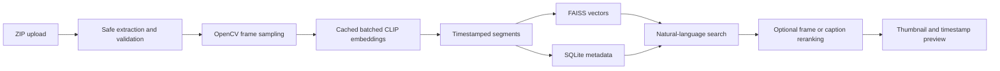

# B-roll AI Search

A small CLIP and FAISS prototype for finding timestamped b-roll with natural-language queries.

## Setup

```powershell
py -3.11 -m venv .venv
.\.venv\Scripts\Activate.ps1
python -m pip install -r requirements.txt
```

Put short, visually different clips in `data/videos/`. For the target evaluation, prepare 20 unique videos with the dataset tool below; the current local folder does not yet contain 20 valid clips.

## Dataset preparation

Kaggle downloads require a configured Kaggle API token and a dataset slug. After choosing a licensed dataset containing short videos, run:

```powershell
kaggle datasets download -d OWNER/DATASET -p data/raw --unzip
python tools/prepare_dataset.py --source-dir data/raw --output-dir data/dataset --limit 20
```

The tool rejects unreadable or over-60-second clips, removes exact duplicates, assigns stable IDs, writes `metadata.csv`, writes `skipped.csv`, and creates train/validation/test splits by video. Add human labels with an annotation CSV containing `filename,description,start_time,end_time` so retrieval metrics have relevant timestamps.

## Index and search

```powershell
python main.py index
python main.py search "A person using a laptop" --threshold 0.20
```

The same reusable functions are available from `ml.indexing` and `ml.search`. The index is rebuilt as a complete library and stored as FAISS vectors plus SQLite metadata under `data/index/`. Image embeddings are batched and cached per video, and thumbnail paths are stored with each segment.

For optional frame-level reranking, call `search_videos(..., rerank_frames=True)` after indexing.

## Streamlit UI

```powershell
streamlit run app.py
```

The UI accepts a ZIP up to 500 MB, extracts at most 50 supported videos, rejects unsafe archive paths and over-60-second clips, indexes readable clips, and supports text and script search. Search results are limited to one segment per video and five total results by default.

## Threshold evaluation

`0.20` is a provisional cosine-similarity cutoff, not a probability. Record scores for matching queries and absent-scene queries, then validate a selected threshold on a separate set. Run labeled evaluation with:

```powershell
python tools/evaluate_search.py data/evaluation_queries.csv
```

Calibrate the threshold against the same labeled examples with:

```powershell
python tools/evaluate_search.py data/evaluation_queries.csv --calibrate
```

Compare sampling intervals, segment sizes, and optional overlap with:

```powershell
python tools/evaluate_configurations.py data/videos data/evaluation_queries.csv --overlap
```

The evaluator reports Recall@5, Precision@5, MRR, and temporal IoU. Benchmark decoding with:

```powershell
python tools/benchmark_ingestion.py data/videos
```

Add average saved-index query latency with:

```powershell
python tools/benchmark_ingestion.py data/videos --query "a person walking" --runs 5
```

When score distributions overlap, present low-confidence suggestions rather than claiming a definitive no-match.

Suggested evaluation queries:

- A cat sitting
- A person running
- A car on a road
- A person using a laptop
- An underwater shark

## Architecture



Known limitations: the current segmenter uses fixed-interval sampling, CLIP and optional captioning models are expensive to load, and the demo needs visually different source clips for meaningful quality evaluation.
